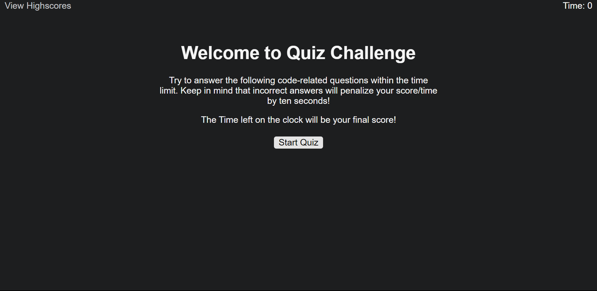

# Quiz Challenge 

**Description**

Quiz Challenge is a timed, multiple-choice coding quiz designed to test your knowledge of various programming concepts. It features dynamic questions, immediate feedback, and a high score system, making it a fun and engaging way to practice your skills.

Image Showing Home Page of application.

Image Showing Quiz Page of application.

**Technologies**

-  HTML
-  CSS
-  JavaScript

**Installation**

1. Clone the repository to your local machine.
2. Extract the contents to a local directory.
3. Open the `index.html` file in your web browser.

**Usage**

1. Start the quiz by clicking the "Start Quiz" button.
2. Read the question carefully and select the answer you believe is correct.
3. A feedbacck will be given as Correct or Wrong answer.
4. For each wrong answers the timer will get reduced by 10 seconds.
5. Your final score is the time left in the timer.

## Contributing

Feel free to contribute to the success of this project. Follow these guidelines:

1. Fork the repository.
2. Create a new branch for your feature or bug fix.
3. Commit your changes.
4. Push to your branch.
5. Submit a pull request.

## Credits

The following articles and websites are used as references for this particular project.

[Professional README Guide](https://coding-boot-camp.github.io/full-stack/github/professional-readme-guide)

[JavaScript](https://developer.mozilla.org/en-US/docs/Web/JavaScript)

[JQuery](https://jquery.com/)

## Deployment Page Link

[Quiz Challenge](https://anjalsali.github.io/Quiz-Challenge/)
